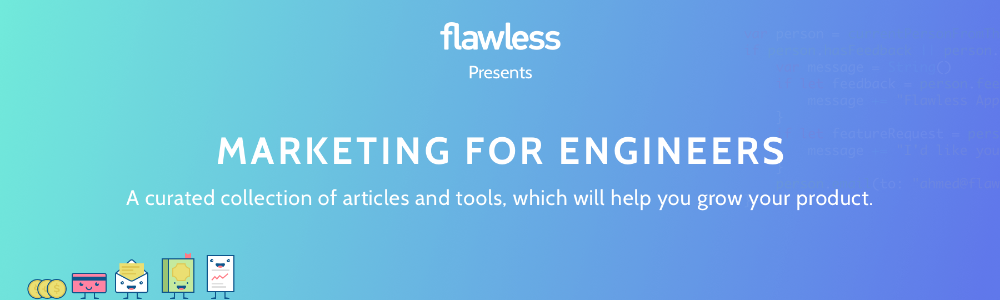

    

💎 It’s is a hand-picked collection of resources for solving practical marketing tasks, such as: 
* finding beta testers
* growing first user base
* advertising project without a budget
* scaling marketing activities for building constant revenue streams. 

We faced these questions, when we made our first product (tool for iOS engineers). It took us almost 2 years to learn how to market our project. 😤 During this time we read, try and bookmarked many useful stuff: articles, videos, spreadsheets, podcasts & tools. These resources helped us a lot! Please, learn, adapt and test awesome marketing hacks from our collection & experience. Good luck!

_Lisa & Ahmed, founders of [Flawless App](https://flawlessapp.io/?utm_source=Github&utm_campaign=Collection-Marketing-For-Engineers&utm_medium=Free-Collection), tool to verify iOS app according to the design_

## 🛠 How to Use and Contribute

For getting needed advice, please:
* Go through our Table of Content. To help you navigate, we`ve added brief overviews of every marketing category. Also, content titles are displayed as clear as possible (so it will tell you the context and how you can benefit from it). 
* Search for a keyword or phrase (for example, “Product Hunt”, “Facebook”, “Blog”).
* Ask [Lisa](https://twitter.com/LisaDziuba) on Twitter.

If you have found some great marketing content or tool, please, contribute to Marketing for Engineers collection. Simply submit a Pull Request with respect to our [Contribution Guidelines](https://github.com/LisaDziuba/Marketing-for-Engineers/blob/master/Contribution_Guidelines.md). We would love you to see your suggestions! 

## 📚 Table of Content
* [User Research](https://github.com/LisaDziuba/Marketing-for-Engineers/blob/master/README.md#-user-research)
* [Marketing without Budget](https://github.com/LisaDziuba/Marketing-for-Engineers#triumph-marketing-without-budget)
* [Content Marketing](https://github.com/LisaDziuba/Marketing-for-Engineers#-content-marketing)
  * [Personal blog](https://github.com/LisaDziuba/Marketing-for-Engineers#sunglasses-personal-blog)
  * [Medium Marketing](https://github.com/LisaDziuba/Marketing-for-Engineers#green_book-medium-marketing)
  * [Promotion of your content](https://github.com/LisaDziuba/Marketing-for-Engineers#mega-promotion-of-your-content)
* [Influencer Marketing](https://github.com/LisaDziuba/Marketing-for-Engineers#influencer-marketing)
* [Marketing for Product Hunt Launch](https://github.com/LisaDziuba/Marketing-for-Engineers#cat-marketing-for-product-hunt-launch)
* [Social Media Marketing](https://github.com/LisaDziuba/Marketing-for-Engineers#-social-media-marketing)
  * [Twitter](https://github.com/LisaDziuba/Marketing-for-Engineers#-twitter)
  * [Facebook](https://github.com/LisaDziuba/Marketing-for-Engineers#facebook)
  * [Reddit](https://github.com/LisaDziuba/Marketing-for-Engineers#reddit)
  * [LinkedIn](https://github.com/LisaDziuba/Marketing-for-Engineers#-linkedin)
  * [Quora](https://github.com/LisaDziuba/Marketing-for-Engineers#quora)
* [Lifecycle Email Marketing](https://github.com/LisaDziuba/Marketing-for-Engineers#love_letter-lifecycle-email-marketing)  
* [Cold Emails Marketing](https://github.com/LisaDziuba/Marketing-for-Engineers#fearful-cold-email-marketing)
* [Building Partnerships](https://github.com/LisaDziuba/Marketing-for-Engineers#bowtie-building-partnerships)
* [Psychology in Marketing](https://github.com/LisaDziuba/Marketing-for-Engineers#%EF%B8%8F-psychology-in-marketing)
* [Business Model and Pricing](https://github.com/LisaDziuba/Marketing-for-Engineers/blob/master/README.md#moneybag-business-model-and-pricing)
* [Other Useful Materials](https://github.com/LisaDziuba/Marketing-for-Engineers#other-useful-materials)
* [Authors](https://github.com/LisaDziuba/Marketing-for-Engineers#-authors)
* [Future Plans](https://github.com/LisaDziuba/Marketing-for-Engineers#future-plans)

## 🔎 User Research
User research gives you an answer for whom is your product. Analysing potential users & customers will help to:
- understand users' needs, pains, motivations and decision-making process; 
- outline product roadmap, key features, UI design and UX scenarios for interacting with your product;
- define the right marketing message (positioning) and choose marketing channels to spread this message;
- make your marketing & communication strategy.

I hope, that I have convinced you that user research is very important. After learning these materials you should be able to make user research, create basic Persona and validate it on real people:
* [How to Create a Concrete Buyer Persona Guide (with templates, tools, Examples, 188 survey questions)](http://optinmonster.com/how-to-create-a-concrete-buyer-persona-with-templates-examples/) by optinmonster.
* [How to Create Customer Profiles to Reach Your Target Audience](http://www.convinceandconvert.com/social-media-strategy/how-to-create-customer-profiles-to-reach-your-target-audience/) by Greg Ciotti. 
* [Design-oriented video](https://www.youtube.com/watch?v=B23iWg0koi8) on performing basic user research.
* Empathy Mapping is one more technique, which widely used in UX for user research. This [Practical Guide to Empathy Maps](https://www.uxpin.com/studio/blog/the-practical-guide-to-empathy-maps-creating-a-10-minute-persona/) will give you a good overview of this approach.

You need to reach your potential users and validate your Persona & hypothesis. You can get real users insight through surveys, interviews, online & offline meetings, chats, Skype calls, checking existing analytics (Google Analytics, social media data), analyzing competitors' customers, ethical googling your users' emails & names and researching them on social media:
* 9-min [video](https://www.youtube.com/watch?v=y5Nt_KRZWtY) on creating a Persona, when you already have something to analyze: website, followers for your product on Twitter\Facebook, first users or paying customers.
* Simple [blueprint](https://blog.hubspot.com/marketing/market-research-buyers-journey-guide) for conducting a thorough buyer's journey study. It's a bit old article, but it has a nice plan for making user research interviews (study) with current or potential users.   
* [Asking the right questions during user research, interviews and testing](https://uxdesign.cc/asking-the-right-questions-on-user-research-interviews-and-testing-427261742a67) will be in use when you actually start talking to potential user (😤 you must do this).

👆 User research is an initial part of customer discovery process. You should not only research your potential users but also test if what you want to build is needed on the market (it’s called Product Market Fit). If you are not familiar with Lean Startup approach, I advise you to check these resources. It's more startup-oriented, but still relevant for newbie product makers:

* [Doing Customer Discovery video](https://www.youtube.com/watch?v=hriiulBbWck) by Steve Blank. 
* 16-min [video](https://www.youtube.com/watch?v=sBhtb6Hb_O4) from Stanford online course on Customer Development and Lean Startups.
* [What is Customer Discovery?](https://www.coursera.org/learn/start-your-own-business-2-ideation/lecture/hRooY/what-is-customer-discovery) video from Coursera course. You can watch it without registration.

📌 Useful tools:
* Google search ([here](http://www.wikihow.com/Use-Google-Advanced-Search-Tricks) you will find how to make clever googling with advanced search).
* [Twitter Advanced search](https://twitter.com/search-advanced?lang=en) and comprehensive [guide](https://zapier.com/blog/twitter-advanced-search-guide/) how to use it.
* LinkedIn search and brief [article](https://blog.linkedin.com/2017/january/19/how-to-make-the-most-of-the-new-linkedin-search) from LinkedIn team on how to use their new search (it's very easy!).
* [Pipl](https://pipl.com/) helps you to find information about email's owners.
* The Buyer Persona Word Doc [Generator](http://www.makemypersona.com/) from HubSpot can help you to make the first hypothesis for your persona.
* [TypeForm](https://www.typeform.com/) is an easy-to-use, mobile-optimized form-builder that's great for gathering online surveys. You also can use Google Forms for making online surveys.

## :triumph: Marketing without Budget
You will find here a collection of free marketing channels for getting the first users. Most of them will take a lot of time & effort, but will not cost money to do it yourself. Some channels, like Content Marketing or Influencer Marketing, are comprehensively explained in its own directories below. So, get fresh ideas from these real-life stories and think what could work for your users:
* [Do Things that Don't Scale](http://paulgraham.com/ds.html) by Paul Graham. He is a co-founder of Y Combinator, computer scientist, investor, and entrepreneur. Paul shows how such popular companies as Stripe, Airbnb or Facebook got their first users. It's more philosophical read for helping your brain to think in the right direction.
* [How to Grow Your Startup on a $0 Marketing Budget](https://producthabits.com/how-to-grow-your-startup-on-a-0-marketing-budget/) by Hiten Shah. It highlights a bunch of different ideas to try.
* [How We Got Our First 2,000 Users Doing Things That Don’t Scale](https://www.fastcompany.com/3024472/how-we-got-our-first-2000-users-doing-things-that-dont-scale) by amazing Ryan Hoover, co-founder of Product Hunt.
* [How we got from $0 to $75,000 MRR with zero marketing budget](https://medium.com/lifecycle-marketing/how-we-got-from-0-to-75-000-mrr-with-zero-marketing-budget-b20101b09a76) by Sergei Gusev. They sent free products (designer fragrance) to the market influencers and got video reviews. It grew their sales dramatically! 
* [How We Got Our First 100 Paying Customers in 24 Hours](https://www.groovehq.com/blog/startup-first-paying-customers) by Alex Turnbull, founder of Groove.
* [Comment Marketing: How to Earn Benefits from Community Participation](https://moz.com/blog/comment-marketing-how-to-earn-benefits-from-community-participation-whiteboard-friday) by Rand Fishkin. You can gain attention to your company by sharing meaningful opinions and thoughts. Rand Fishkin made an excellent 9-minute video on using this technique 👌.
* [5 Places to Find and Poach Your Competitors' Customers](http://www.artofemails.com/prospecting-methods#change). Sapph shares many smart ways to find leads and pitch them.
* [Hacking the Press: Clever Ways to Get Free Press Coverage with Zero Budget](https://www.shopify.com/blog/15973132-hacking-the-press-clever-ways-to-get-free-press-coverage-with-zero-budget) by Tucker Schreiber from Shopify. The post is focused on online stores industry. But the principles of getting free press attention are applicable to any market. 
* [Referral Marketing](https://www.referralsaasquatch.com/comprehensive-referral-marketing-guide/) and [Mobile Referral Marketing](https://www.referralsaasquatch.com/ultimate-guide-to-mobile-referral-marketing/) can give you the word-of-mouth growth. For inspiration check [51 Best Referral Program Examples of 2016](https://www.referralsaasquatch.com/ultimate-guide-to-mobile-referral-marketing/). These useful guides were prepared by Brandon Gains from  Referral Saasquatch.
* [5 Low-Cost Guerrilla Marketing Tactics](https://www.shopify.com/blog/116564869-5-low-cost-guerrilla-marketing-tactics-to-grow-your-business-offline) via Braveen Kumar. :monkey: Direct offline exposure via foot traffic would suit physical products and brave founders.
* [Use free tools for lead generation](https://blog.clearbit.com/how-were-using-free-tools-to-engage-developers/) when you have a difficult software product with many use cases. It's a great way to show benefits of your main offering and increase brand awareness. This post shows how to sell Clearbit API-solution via free easy-to-use tools. You can invest your time and make some free stuff as well — UI kits, browser extensions, funny games or open source tools.

:bowtie: We used many free marketing channels. To be honest, when we started [Flawless App](https://flawlessapp.io/?utm_source=Github&utm_campaign=Collection-Marketing-For-Engineers&utm_medium=Free-Collection) we didn't have other ways. We wrote cold emails, talked to influencers, manually recruited users at events, posted at Facebook groups, worked with developers & designers via Twitter and did many other stuff. These gave us our first 1000 beta users. So it worth trying out!

## 💎 Content Marketing
Content marketing is about promotion via content. You can run a personal blog, guest blog or write at platforms, like Medium (or combine it). Focus on how you can help your users with your content. You don't have to be a professional writer for making cool articles. Just give yourself space to be creative and share your expertise.

I encourage you to start doing content marketing by yourself. Outsourcing it can be very tricky, especially at the beginning.
🤔 Firstly, think how your blog or content is you going to stand out. There are plenty of cool blogs in every industry. How are you going to be different? What unique value can you offer to your users? How can you build an engaged readers community? And the most important question is how you will convert readers into leads. With all those considerations, you should create a content strategy:
* [How to Use Customer Research to Get Better Results from Your Content Marketing Program](https://www.crazyegg.com/blog/research-for-better-results-content-marketing/) by Crazyegg. 
* [How to Generate Strategic Content Ideas for Each Funnel Stage](https://blog.ladder.io/content-strategy/) by Tyler Hakes.
* [Growing From 0-12k Organic Visitors by Mapping Content to the Sales Funnel](https://growandconvert.com/content-marketing/grew-organic-visitors-suggested-search-hack/) by Benji Hyam. This post shows how to make the content strategy for mobile and web-oriented blog.
* [Behind the Scenes: How We’ve Built a $5M/Year Business in 3 Years With Content Marketing](https://www.groovehq.com/blog/how-we-built-a-5m-business-with-content-marketing) by Alex Turnbull. An exciting story how Groove rebuilt their content marketing strategy with the focus on what could actually help their market.
* A case study with the framework on [Creating Content That Generates 400,000 Targeted Visitors](http://okdork.com/how-you-can-create-content-that-generates-40000-targeted-visitors/) by Brian Dean.
* [How to convert leads directly off of your blog with help on Popups 💰](https://sumo.com/stories/email-popup-lead-generation) by Benji Hyam.
* [How To Convert Blog Traffic Into Customers With CTAs: The Complete Guide](https://growandconvert.com/conversion-rate-optimization/blog-conversion-strategy/) by Devesh Khanal.     
* [How to Turn Your Blog’s Thank You Page Into a Lead Generating Machine](https://growandconvert.com/conversion-rate-optimization/thank-you-lead-generating-machine/) by Emil Shour.
* [Content Marketing ROI: How We Measure Success at Hubstaff](http://blog.hubstaff.com/measuring-content-marketing-roi/) by Ilia Markov.
* And don't forget to calculate [The Customer Acquisition Cost of Content Marketing](https://growandconvert.com/content-marketing/customer-acquisition-cost/#). Devesh Khanal has divided the cost into 3 categories: costs per article, salary costs and technology costs. You can repeat his calculations for your case and get approximate budgets.

### :sunglasses: Personal Blog
Start by creating a blog that not only touts your product but offers helpful recommendations, tips & tricks, links, etc. Check what competitors' blogs are publishing, what is popular in the industry and what your users are interested in. Align your article ideas with the content strategy, you have already defined. To get some inspiration scroll these bits of advice:

* [How We Come Up With Ideas for the Blog](https://www.helpscout.net/blog/blog-post-ideas/) by Emily Triplett Lentz from Help Scout team.
* [How to Generate Content Ideas With These 3 Awesome Tools](http://buzzsumo.com/blog/how-to-generate-content-ideas-with-these-3-awesome-tools/). Robert Katai shows how to use tools 🔎 to find out what people are asking about your industry (via keywords).
* [266 blog post ideas](https://midasmedia.co.uk/killer-blog-post-ideas-no-more-writers-block/) from Ed Leake. It’s a mix of many topics to write about. Feel free to scroll it and steal relevant stuff. 
* [A Simple Guide To Figuring Out What To Blog About](http://howtomakemyblog.com/blog-topic/). As Marko Saric mentioned, 🙏 the perfect topic is found by interlinking your passion and personality with the demand from the market.
* If you have skipped articles in the Content Marketing section above, I do encourage you to read them! The first 4 articles have excellent frameworks for getting strategic content ideas.

Pick the most appropriate content format — video, list, long-read. Then think about the right headline for driving interest to your great article:
* [Research on writing viral headlines](http://buzzsumo.com/blog/5-ways-create-amazing-viral-headlines/) by Steve Rayson from BuzzSumo.
* [30+ Ultimate Headline Formulas for Tweets, Posts, Articles & Emails](https://blog.bufferapp.com/headline-formulas) from Buffer team.
* [Copywriting Headlines That Sell (with Templates & Swipe File)](https://kopywritingkourse.com/copywriting-headlines-that-sell/) via KopywritingKourse.
* [The 3-Step Bulletproof Formula To Writing Kickass Blog Post Headlines](https://growandconvert.com/content-marketing/writing-blog-post-headlines/) by Danavir Sarria.
* [Why Writing Creative Headlines Hurt Conversions: What We Learned Analyzing 150,000 Opt-Ins](https://sumo.com/stories/writing-headlines) by Sean Bestor.

Craft your blog with SEO focus:
* [The Complete Guide to Blog SEO](http://webris.org/blog-seo-how-to-optimize-your-blog-for-google/). Ryan Stewart covers more than just making your blog SEO-friendly. Ryan talks about blog strategy, keywords research, and promotion of your blog via building links to posts.
* [How To Rank Your Blog Posts On Google’s First Page](http://howtomakemyblog.com/blog-seo/). Marko Saric keeps focus on SEO optimization for WordPress blogs. 
* [The 10 Types of Content That Work Best for SEO](https://moz.com/blog/the-ten-types-of-content-that-work-best-for-seo-whiteboard-friday). Rand Fishkin advises on which format should you use for your project.
* [How To Use 11+ Free Tools To Find Prequalified Content Ideas for SEO](https://www.shivarweb.com/4275/finding-content-ideas-for-seo/) from Nate Shivar. The article will teach you how to prequalify your content ideas with SEO research.

📌 Check your grammar! I use these cool apps:
* [Hemingway App](http://www.hemingwayapp.com/)
* [Ginger Grammar Checker](http://www.gingersoftware.com/grammarcheck)
* Browser extensions, like [Grammarly](https://app.grammarly.com/).

### :green_book: Medium Marketing
Medium is an online publishing platform with the huge active community. You can make your blog there and engage with your users and Medium readers. You still need to promote your articles yourself. Medium is a high-traffic community, but you are not the only one who competes for attention.

Basics of writing on Medium. How to write, edit, publish and add your article to publications:
* [FAQ from Medium on Writing](https://help.medium.com/hc/en-us/sections/115001484727-General).
* [Useful keyboard shortcuts](https://help.medium.com/hc/en-us/articles/214672207).
* [How to insert code blocks & inline code](https://help.medium.com/hc/en-us/articles/224550008-Code-blocks-inline-code) to your articles.
* [Tips and tricks for Medium writers](https://blog.medium.com/tips-and-tricks-for-medium-writers-1d79498101c3).
* [How to add draft or post to publication](https://help.medium.com/hc/en-us/articles/213904978-Add-draft-or-post-to-publication).
* [What are the pros and cons of publishing via Medium vs. your own domain?](https://www.quora.com/What-are-the-pros-and-cons-of-publishing-via-Medium-vs-your-own-domain) via Quora.

Articles, where you can find what topics, titles, collections, tags, categories and post length are popular for Medium readers:
* [How to write Medium stories people will actually read](https://medium.freecodecamp.com/how-to-write-medium-stories-people-will-actually-read-92e58a27c8d8) by Quincy Larson.
* [Medium’s Most Recommended Stories of 2016](https://medium.com/startup-grind/mediums-most-recommended-stories-of-2016-171efdd705c5) by Levent Aşkan.
* [How to Win at Medium (advice on the title, text formatting & images)](https://blog.medium.com/how-to-win-at-medium-d662e11b0373) by Elizabeth Tobey.
* [35 Actionable Tips to Grow Your Medium Blog](https://medium.com/swlh/35-actionable-tips-to-grow-your-medium-blog-4e4017b89905) (timing, some promotional tips) by Ali Mese.
* [What I learned from analyzing the top 252 Medium stories of 2016](https://medium.freecodecamp.com/what-i-learned-from-analyzing-the-top-253-medium-stories-of-2016-9f5f1d0a2d1c) by Quincy Larson.

Publishing on Medium or elsewhere removes all your technology hassles. It's a good place to start implementing your content marketing strategy.

### :mega: Promotion of your content
You need to promote content on your own blog, Medium or guest platforms. Some ideas how to spread the word about your great articles and make it more shareable:

* [38 Free Places to Promote Blog Posts Once You Hit Publish](http://www.mybloglift.com/places-to-promote-blog-posts/). Learn about every platform before sharing your content there (or you will become a spammer💩). At the end of the article Shafi Khan mentioned other important rules to follow.
* [Content Promotion: How We Grew from 0 to 32,977 Users in 5 Months With Zero Paid Traffic](https://growandconvert.com/content-marketing/community-content-promotion/). Benji Hyam talks about community-driven content promotion. It means, that you engage with the targeted community and then share your content so that it adds value.
* [17 Advanced Methods for Promoting Your New Piece of Content](https://blog.kissmetrics.com/17-advanced-methods/) by Kissmetrics team.
* [Boost Social Sharing From Your Content](https://sumo.com/stories/social-sharing-chapter-2). Sarah Peterson shared methods, that will help readers to easily share your posts.
* A useful guide on [Blogger Outreach: How to Get Influencers to Promote Your Content for Free](https://smartblogger.com/blogger-outreach/) by Brian Dean. 
* [I Asked 235 People to Tweet My Article and All I Got Is This Cheerless Case Study](https://ahrefs.com/blog/asking-for-tweets/). It's an interesting experiment! Joshua Hardwick cold emailed writers who tweeted similar posts and asked for a promotional tweet. You can try this too.
* [Sharing Other People`s Content and Simultaneously Promoting Your Own](https://searchwilderness.com/sharing-other-peoples-content/) by Paul Shapiro. 😯 Have you ever tried to include your blog in the UTM parameters of somebodies else blog post? Paul will teach you this smart hack.
* [Strategic Guide to Reposting Content on Medium and LinkedIn](https://ryanbattles.com/post/reposting-content) by Ryan Battles. Does re-publishing strategy lead to growth or penalties? Ryan Battles made informational podcast & article on the topic.
* [The Simple Way to Get People to Read Your Blog Post on Facebook](http://adamrogersuk.com/blog/post-blog-on-facebook/) by Adam Rogers. Nice ideas on optimizing your republished piece of content on Facebook.
* [How to get featured on large publications with republished content](https://sumo.com/stories/traffic-from-republishing) by Sarah Peterson.

Content Marketing is not only about getting people to read your amazing articles (and use your product later). It's also about developing and maintaining relationships with the community.

## 💃Influencer Marketing
Influencer marketing is focused on working with opinion leaders to drive company message/product/service to the larger market.  📚 These long guides will be good for the 
start: 
* [What is influencer marketing and how to find influencers?](https://blog.bufferapp.com/influencer-marketing) by Ash Read from Buffer.
* [The Ultimate Guide to Influencer Marketing](https://sumo.com/stories/influencer-marketing-super-connector) by Jason Quey from Sumo.
* [Influencers definitely should be compensated. The only question is how](http://klear.com/blog/paying-an-influencer/) by Yuval Maoz.

You should not be afraid to reach to the cool people. Be helpful, nice and creative:
* [The Exact Email Scripts I Use to Connect With VIP’s](https://www.groovehq.com/blog/vip-email-scripts) by Alex Turnbull, founder of Groove.
* [8 Email Pitch Templates to Partner with Influencers](http://www.artofemails.com/partnerships#promote-product) by Sapph. Nice guides & examples for asking promotion, contribution, partnership or review from the influencer. Customize and use them!
* 😱 [I Just Deleted Your Outreach Email Without Reading. And NO, I Don’t Feel Sorry](https://ahrefs.com/blog/outreach/) by Tim Soulo. Tim shows cool examples how to email influencers in the right way. Please, read this post before contacting opinion leaders!
* [If you can’t express yourself by email, you’re not worthy of anyone’s time](https://levels.io/email-cuts-through-bullshit/) by Pieter Levels. People are busy and you should avoid vague messages, which only steals time. Read this brief article to understand what opinion leaders want to see in their inbox.
* Good videos on [Finding influencers on Twitter](https://www.youtube.com/watch?v=8ecAWMMleks) and [6 easy ways to engage with them on Twitter](https://www.youtube.com/watch?v=qLvKfc2CMOs) by 123 Reg team.
* [The Barney Stinson’s Playbook For Cold Tweeting Influencers](http://klear.com/blog/influencer-outreach-with-cold-tweets/) by Noam Avigdor.
* [4 Tips for Reaching Out to Someone You Admire on LinkedIn](https://www.themuse.com/advice/4-tips-for-reaching-out-to-someone-you-admire-on-linkedin) by Lily Herman. 
* [26 Headliners on How to Connect with Influencers at Conference](https://venngage.com/blog/connect-with-influencers-conference/) by Venngage. Don't be afraid to talk to people!
* [Connecting with Others: What Have You Done for Me Lately?](http://okdork.com/what-have-you-done-for-me-lately/) by Noah Kagan, popular IT entrepreneur & influencer. I loved his brief instruction on making its easier for people to say YES to your request.

Case-studies, which can teach and inspire you:
* [How We Got 1,000+ Subscribers from a Single Blog Post in 24 Hours](https://www.groovehq.com/blog/1000-subscribers) by Alex Turnbull. Groove team built relationships with influencers for getting the first readers on their blog. Very smart tactics there!
* [This Songwriter Accidentally Executed Influencer Marketing Perfectly and Got 40k Viewers Overnight](https://growandconvert.com/marketing/influencer-marketing-case-study/) by Benji Hyam.
* [How Influencer Marketing helped us grow from $0 to $700k+ monthly revenue](https://medium.com/lifecycle-marketing/how-influencer-marketing-helped-us-grew-from-0-to-700k-monthly-revenue-51644e79f7a9). Sergei Gusev shows how they scaled influencer marketing with the help of paid influencers marketing platforms. The 1st part of his story is [here](https://medium.com/lifecycle-marketing/how-we-got-from-0-to-75-000-mrr-with-zero-marketing-budget-b20101b09a76).

📌 Useful tools:
* [Find Twitter Influencers via Klear](https://klear.com/free-tools/find-influencers-by-skill). It's free for 10 keyword searches ("skill"). Paid version has more advanced options.
* Social networks. You can find opinion leaders by checking the keywords search, followers number and engagement level.
* [Twitonomy](http://www.twitonomy.com/) gives a detailed info about influencer from his Twitter profile. It can show people who are interacting with the influencer on the regular basis. Those people can become your starting point to get to the top-niche person.
* [Followerwonk Analyze](https://moz.com/followerwonk/analyze/) gives a huge database about any Twitter user's network. This free tool shows you info on user followers and people, whom this user follows. So you can find the best time to engage, popular users, location info, etc.
* Use RSS apps for getting content from influencers' blogs. You can comment those posts and share good one via your social media. [Selfoss](https://selfoss.aditu.de/) is a good RSS app. It's an open source, so you may dig into its code and customize things.

## :cat: Marketing for Product Hunt Launch
Product Hunt (PH) is a place to discover, share, and geek out about new products in tech. Submitting your product there is a good way to appear in front of journalists, tech people and fellow makers. After submission, the product will participate in the daily race. The race starts PST 00:00 and finishes PST 23:59. You have to get as many upvotes and comments as you can by the end of the day! :trophy: The most successful products appear on the Homepage and can get a lot of honest feedback, downloads, users and PR buzz. Please, check success PH stories to decide if PH is the right launch platform for you!

Start with [basic rules on Posting](https://help.producthunt.com/posting): how to post or comment, how to ask for support, how to get to the homepage. Then read [Five things everyone should know about Product Hunt](https://medium.com/product-hunt/five-things-everyone-should-know-about-product-hunt-fac74f44c32b). Join the PH community and feel how it works, before actually starting you launch activities.

:scream: Successful PH launch takes a lot of preparation, promotion during the launch (24h++) and follow-up work. These guides will help you:
* [How to Launch on Product Hunt 🚀](https://blog.producthunt.com/how-to-launch-on-product-hunt-7c1843e06399) by Product Hunt team.
* [Product Hunt 101](https://medium.com/swlh/product-hunt-101-426511f03501) from one of the top hunters, Robleh Jama. It's very useful to listen to the launch algorithm from the person, who submit a lot of different products.
* [The SaaS founder’s guide to Product Hunt](https://blog.amplifr.com/en/amplifr-on-producthunt/) from the Russian company, Amplifr. It's a nice tutorial about your product preparation (onboarding, language check, emails and other not obvious stuff).
* [Master Checklist for Launching on Product Hunt (spreadsheet)](https://docs.google.com/spreadsheets/d/1ebg2HyS5P-WkznG5Tvr7mYtKZqXsDLXARtYWpxfkieo/edit#gid=0) by SpreadShare team.
* [Launching on Product Hunt: what works and what doesn’t [guide & case study]](https://hackernoon.com/launching-on-product-hunt-what-works-and-what-doesnt-guide-case-study-776c77d56e26) by 3D modeling app, who launched on PH in December 2016. These folks have not typical "sweet product for startup audience" and their launch was "so-so" good. I encourage you to think about resources you will invest in PH launch versus possible outcome!
* [Is Product Hunt useful for developer tools?](https://medium.com/flawless-app-stories/flawlessapp-on-producthunt-7db3e561ce7a). It's our story of launching on PH. We shared our marketing tactics and all results: traffic numbers, trials installations and sales. Hope, it will help some of you to succeed on Product Hunt! 
* [Launching on Product Hunt: A curated checklist from +50 successful launches](https://medium.com/startup-grind/how-we-got-1000-upvotes-on-product-hunt-by-curating-a-checklist-from-50-successful-launches-6b77ce29b444) by Hidden Founders team. 

📌 Useful tools:
* You can find a list of top hunters at [All-time Leaderboard](https://www.yvoschaap.com/producthunt/) or [Top 500 Hunters](http://500hunters.com/).
* A dynamic list of the [100 least upvoted projects on PH](http://www.productrunt.com/). It's good to check failed PH launch cases.
* [Daily Top 5 products on PH in one chart](http://tophuntsdaily.herokuapp.com/), which can show you dynamics of upvote grows on daily basis.
* Product Hunt Analytics: [Daily, monthly, and yearly analytics with Product Hunt data](http://www.phlics.com/).
* [MakerTools](http://makertools.xyz/) allows you to create a Twitter list of all the wonderful folks who upvoted your product. It's a good practice to thank those people for supporting your PH launch via Twitter.
* [Crisp Live Chat](https://crisp.im/en/) is very useful during your launch campaign when people ask things in a real-time. Such communication can increase conversion at your site and give you a lot of insights. We use the free version of it and it's awesome so far.

## 📷 Social Media Marketing
Let's start with the basics, which can be used for any social media platform:
* [How to Create a Social Media Marketing Strategy From Scratch](https://blog.bufferapp.com/social-media-marketing-plan) by Kevan Lee, Buffer Marketing Director. It's a comprehensive long-read about basic of making your SMM strategy.
* Case-study from Hubstaff: [The Improved Social Media Content Strategy That Boosted Visits by 230%](http://blog.hubstaff.com/updating-hubstaff-social-media-content-strategy/).
* Guide on Copywriting for social media: [10 Ways to Write Damn Good Copy](http://www.copyblogger.com/good-copywriting/).
* [The Psychology of Social Sharing: How to Shape Your Content According to What People Want to Share](https://designschool.canva.com/blog/psychology-social-sharing-shape-content-according-people-want-share/) via  Canva.

📌 Useful SMM toolbox:
* When you have multiple Social Media accounts, use dashboards & tools for managing them in one place. My favorite ones are [Buffer](https://buffer.com/) and [Hootsuite](https://hootsuite.com/) (both have free options). These tools have built-in analytics. So you can pick simple metrics that are meaningful and can be analyzed.
* [Pablo](https://pablo.buffer.com/) and [Canva](https://www.canva.com/) for fast creating of nice-looking images (both free).
* [Nuzzel](http://nuzzel.com/) can show you the top content being shared among all your followers on Twitter and Facebook. You can use that content for sharing or as an example. It's free tool.
* [Google Analytics Campaign URL builder](https://ga-dev-tools.appspot.com/campaign-url-builder/) for making UTM codes and here is a guide on [Using UTM Parameters to Track Social Media Success](https://blog.hootsuite.com/how-to-use-utm-parameters/) from Hootsuite.

### 🐦 Twitter
I love Twitter as a tool for personal use. Moreover, Twitter has a huge variety of opportunities to promote your product — personal account, company account, Direct Message Marketing, Chats, Adds. Twitter can be used for sharing your articles, connecting with influencers or looking for competitors' customers. As you see, it's a powerful platform for many marketing activities, depending on your goals.  

Your personal account can drive traffic to your product and content. While growing your Twitter followers, you increase the media reach you might get. But don't forget, that Twitter is made for people. To be successful there, you need to communicate with your audience just as you would do offline. If your target audience like your tweets and your personality, there’s a higher chance they will trust you and click on your links:
* [How to Get Higher Tweet Engagement? We Analyzed 23,858 Tweets](https://adespresso.com/academy/blog/get-higher-tweet-engagement-analysis-23858-tweets/) by Karola Karlson. It's a long read about what, when and how to tweet. Although the main focus is on marketing industry, the key insights will be useful for tech as well.
* [8 Tactics for Increasing Your Twitter Reach](http://www.socialmediatoday.com/social-networks/8-tactics-increasing-your-twitter-reach) by Patrick Whatman.
* [Get More (High Quality) Twitter Followers by Stalking Influencers](https://searchwilderness.com/get-followers-on-twitter/) by Paul Shapiro.
* [5 ways to increase your Tweet engagements with emojis](https://business.twitter.com/en/blog/5-ways-to-increase-your-tweet-engagements-with-emojis.html) from Twitter team.
* Taking part in Twitter chats is a great way to attract new followers and actively participate in relevant conversations with people from your industry.

There is nothing wrong with automating your Twitter activities. You can schedule posts, automatically send messages and set up rules for auto-engagement with users. However, using automation only 🤖 will hurt your SMM strategy. So mix it with a real-time tweeting and being active & helpful with the community: 
* [I Automated My Tweets for 30 Days and This is What Happened](https://inbound.org/blog/i-automated-my-tweets-for-30-days-and-this-is-what-happened) by Tami Brehse. Tami scheduled 60 tweets with her blog posts for one month. Her overall site traffic showed how people actually engage with automated tweets.
* [Twitter Deep Dive: How to Use Social Media to 10x Your Website Traffic (video)](https://moz.com/blog/twitter-deep-dive-10x-your-website-traffic-whiteboard-friday) by Tara Reed. Tara shared a cool guide on building Twitter strategy and automating your engagement workflow. Clever automation is awesome 👌.
* [How to automate Twitter content curation with RSS blog feeds](http://www.jeffbullas.com/2017/02/27/how-to-automate-twitter-to-get-attention-and-grow-your-followers/). Jeff Bullas uses Dlvr.it for automation, this tool has a good free plan. Be aware, that simply spamming content to your social networks will not work out.
* [The Pros & Cons of Twitter Automation](https://www.searchenginejournal.com/pros-cons-twitter-automation/164078/) by Michael Georgiou. Check possible downsides to know how to avoid them.
* [Is “fake” Twitter following working?](https://aggregateblog.com/automated-twitter-following-tools/) by Karola Karlson. New accounts suffer from a lack of followers. Follow-Unfollow tools seem like an obvious solution to give you the "first followers". But in most cases, it will be bots or inactive users.

Direct Message Marketing is about sending personal, mass or automated DMs to your followers. These articles will show you how to use this tool in a right way:
* [7 Twitter Direct Message tactics absolutely anyone can use](https://audiense.com/7-twitter-direct-message-dm-tactics-anyone-social-media-marketing-communications-manager-can-use/) by Paz Segura.
* [Why Twitter Auto DMs are Evil (and what you should do instead)](http://www.blogclarity.com/why-twitter-auto-dms-are-evil-and-what-you-should-do-instead/) by Melissa Culberson. Melissa proves, that if you send impersonal auto-DM with some spam, that will only annoy your users.
* [Case study when auto-DMs actually were working](http://niknitro.com/auto-dm-not-auto-dm/) by Nik Nitro. Welcome auto-DMs should be used only when it provides tangible value to a new follower. Nik shows his example.
* [Be aware of Twitter tweet & DM limit](https://support.twitter.com/articles/15364).

📌 And these tools help you maximize your Twitter presence, from timing to sharing to the analysis:
* [Buffer](https://buffer.com/) and [Hootsuite](https://hootsuite.com/) for scheduling (were mentioned already).
* [Trend24](https://trends24.in/) shows the latest Twitter trending topics (hashtags) through out the day locally and globally.
* [Hashtagify](http://hashtagify.me/) is advanced Twitter Hashtags search engine. It recommends you related hashtags to your keyword, shows several influencers for this keyword and relevant tweets. Very useful free tool for choosing hashtags for your tweets!
* [Statusbrew](https://statusbrew.com/) allows you to manage your followers (Audience Feature) and scheduled tweets. Statusbrew finds inactive, spammy or not following back accounts. The tool has very good free version.
* [Followerwonk Analyze](https://moz.com/followerwonk/analyze/) gives a huge database about any Twitter user's network. This free tool shows you info on user followers and people, whom this user follows. So you can find the best time to engage, popular users, location info, etc.
* [Twitonomy](http://www.twitonomy.com/) provides you detailed info about your Twitter account (or any other). Twitonomy UI is terrible. But it can show analytics of your hashtags usage, daily activity (time & days), followers, retweets statistics. All these insights are available in the free version. Also, this tool is useful for Influencer Marketing research.
* [Dlvr.it](https://dlvrit.com/) and [Hootsuite](https://hootsuite.com/) for grabbing website RSS feeds and auto-sharing the content. Free accounts permit several RSS feeds.
* [Free Twitter Follower Report](https://simplymeasured.com/freebies/twitter-follower-analytics) will allow you to download all your followers and information about them.
* I mentioned tools, that I personally use. However, there are plenty of other great tools to try: [The Big List of Twitter Tools: 93 Free Twitter Tools and Apps to Fit Any Need](https://blog.bufferapp.com/free-twitter-tools) by Kevan Lee from Buffer team.

### Facebook
Facebook has many marketing options that could fit your company focus, budget, and your current knowledge. To target your users there you can work with Personal Profiles, Pages, Groups, and Ads.

🐣 Facebook Pages & Groups:
* Many interesting thoughts on content, post types and other beginners questions: [The Ultimate Guide to Facebook Engagement in 2017](http://buzzsumo.com/blog/ultimate-guide-facebook-engagement-2017/) by Susan Moeller.
* [How to Start Your Facebook Business Page](https://sproutsocial.com/insights/facebook-business-page-guide/) by Alex York.
* [How to Write Facebook Status Updates That Will Leave Your Audience Coming Back for More](http://neilpatel.com/blog/write-facebook-status-updates/) by Neil Patel. It's a useful read, but be aware of many promotional ads with Neil face. 
* [How to Stand Out with a Brilliant Facebook Cover Photo](https://designschool.canva.com/blog/how-to-stand-out-with-a-brilliant-facebook-cover-photo/) by Adrienne Branson.
* [Facebook page promotion tips](https://socialspacers.com/blog/facebook/tips-for-effective-business-facebook-fan-page/) by SocialSpacers.
* Facebook Group can help you gather your fans in one place and encourage them to interact with one another. Groups are useful for building an active community of people talking about your product, giving feedback or ideas. It's the good place to have the discussion on betas, coming feature questions, and bugs.   

🐤 The Beginner’s Guides to Facebook Advertising. Here you will find step-by-step tutorials for setting up your first ad campaign. I also included articles about ads design, copywriting and typical mistakes. If you have skipped previous content, it will be useful to check posts on the viral headlines in the Personal Blog section and posts in the Social Media Marketing section. 
* [The Complete, Always-Updated Guide to Facebook Advertising](https://blog.bufferapp.com/facebook-ads-guide) by Kevan Lee, Buffer Marketing Director. Buffer has put together a comprehensive guide on learning Facebook advertising, from the ad setup to analysis.
* [Defining Your Facebook Campaigns’ Goals and Strategies](https://adespresso.com/academy/guides/facebook-ads-optimization/facebook-campaign-strategy-goal/) from AdEspresso team.
* Good advice on Ad Copywriting: [The Beginner’s Guide to Writing Facebook Ads](https://copyhackers.com/2016/06/writing-facebook-ads/) by Joanna Wiebe.
* [Practical post on creating emotional Facebook ads](https://blog.kissmetrics.com/emotional-marketing-to-facebook-ads/) by Karola Karlson from Kissmetrics.
* [16 Secrets the Pros Use to Create Great Facebook Ad Designs](https://adespresso.com/academy/blog/9-tips-perfect-facebook-ad-design/) by Massimo Chieruzzi from AdEspresso team.
* [The Primary Reasons Your Ads Don’t work and Keys to Facebook Advertising Success](https://www.jonloomer.com/2017/02/17/facebook-advertising-success/) by Jon Loomer.
* [After 1.6 Billion Ad Impressions and 408 Facebook Ads, Here’s What I’d Do Differently](https://adespresso.com/academy/blog/after-1-6-billion-ad-impressions-and-408-facebook-ads-heres-what-id-do-differently/) by Karola Karlson.
* [What I learned spending $2 Million on Facebook Ads](http://okdork.com/how-to-start-advertising-on-facebook/) by Noah Kagan.

🐔 Advanced reading on Facebook Advertising. May the Force be with you!
* [The Complete Guide to Facebook Ads Manager: How to Create, Manage, Analyze Facebook Ads](https://blog.bufferapp.com/facebook-ads-manager) from Buffer team.
* [The Facebook Pixel: What It Is and How to Use It](https://blog.hootsuite.com/facebook-pixel/) from Hootsuite team. 
* [6 Ways to Add the Facebook Pixel to Your Website](https://www.jonloomer.com/2017/02/24/facebook-pixel/) by Jon Loomer.
* [101-Point Guide To Master: Facebook Custom Audiences](https://klientboost.com/ppc/facebook-custom-audience/) by Karola Karlson.
* [The Big Damn Guide To Facebook Ad Targeting](https://www.contentharmony.com/blog/facebook-ad-targeting/) by Kane Jamison.
* [Messenger As a Destination for Facebook Ads (podcast)](http://thechatbubble.com/2017/01/messenger-as-a-destination-for-facebook-ads-solo-message/) and [an illustrated guide to this tool (post)](https://chatbotsmagazine.com/an-illustrated-guide-to-facebook-messenger-destination-ads-dd543d2659d0) by @Mssg.
* [How to Use Facebook Insights & Analytics to Boost Social Media Marketing Strategy](https://blog.bufferapp.com/facebook-insights) by Alfred Lua from Buffer.
* Good video on [using remarketing and targeted content creation to get more conversions out of your Facebook ad](https://moz.com/blog/facebook-funnel-that-converts-whiteboard-friday). Ryan Stewart talks about marketing funnel framework and touchpoints that you have to build for your campaign. 
* [Facebook Website Custom Audiences: A Definitive Guide for Remarketing](http://www.jonloomer.com/2015/09/11/facebook-website-custom-audiences-guide/) by Jon Loomer.
* [A/B Testing Facebook Ads: 121 Tips & Ideas for Extraordinary Discoveries](https://klientboost.com/ppc/facebook-ad-testing/) by KlientBoost.
* [Facebook Ads Bidding 101: Everything You Need to Know](https://adespresso.com/academy/blog/everything-need-know-facebook-ads-bidding/) by Massimo Chieruzzi from AdEspresso team.
* [29 Facebook Ad Mistakes That Are Budget Drainers](https://klientboost.com/ppc/facebook-ad-mistakes/) by Johnathan Dane from KlientBoost.
* [Facebook Ad Conversion Attribution: What You Need to Know](https://www.jonloomer.com/2017/05/11/facebook-ad-conversion-attribution/) by Jon Loomer.
* [Facebook Ads Review 101: Rules to follow to get your ads approved quickly!](https://adespresso.com/academy/blog/facebook-ads-review-rules/) by Massimo Chieruzzi.
* [The Ultimate Guide to Facebook Video Ads](http://www.digitalmarketer.com/facebook-video-ads/) by Digital Marketer. High five if you have read until this point ✋.

### Reddit
Reddit is one of the most active internet community with its own unique culture. You can get tons of cool information there, great product feedback and first users. :trollface: However, it's better to learn Reddit rules and basics before you get banned:
* [How to Use Reddit: Beginners Guide](https://www.shopify.com/blog/how-to-use-reddit) by Braveen Kumar.
* [Reddiquette](https://www.reddit.com/wiki/reddiquette). Pay extra attention to the "please don't" section.
* [Self-promotion on Reddit](https://www.reddit.com/wiki/selfpromotion).
* [A complete glossary of Reddit terms](https://www.reddit.com/r/TheoryOfReddit/wiki/glossary).

Guides on promoting and advertising on Reddit:
* [How to Promote on Reddit without Getting (Shadow) Banned or Deleted](http://vyper.io/blog/promote-on-reddit/) by Vyper.io team.
* [My Experience & 9 Ideas for Advertising on Reddit](https://www.shivarweb.com/3100/how-to-advertise-on-reddit/) by Nate Shivar.
* [How To Make Your First $1,000 with Reddit Ads](http://ryanluedecke.com/reddit-ads/) by Ryan Luedecke. It's an old, but super informative tutorial.
* [The Reddit Ads Experiment: What We Learned for $250](https://blog.ladder.io/reddit-ads/) by Alex Berman. Spoiler: "we got a clear confirmation that the Reddit community is still Ad-proof and smells/ignores promoted posts".
* [How to Build a Passionate Fanbase with Reddit](https://adespresso.com/academy/blog/how-to-build-a-passionate-fanbase-with-reddit/) by Ana Gotter.
* Another interesting case: [How To Use Reddit For SEO & Content Marketing Research](https://www.shivarweb.com/3778/use-reddit-seo-content-marketing/) by Nate Shivar.

📌 Useful tools:
* [Later](https://laterforreddit.com/) helps to schedule your posts to Reddit and cross-post your link to other subreddits. The tool has a free option.
* [Subreddit Analysis Tool from Later](https://dashboard.laterforreddit.com/analysis/). It's a free tool to get insights about subreddits. 
* [Reddit Insight](http://www.redditinsight.com/) is an analytics tool for real-time post tracking, single user tracking, and other data analysis.
* [SnoopSnoo](https://snoopsnoo.com/) provides Reddit user and subreddits analytics.
* [RedditList](http://redditlist.com/) is useful for digging up worthwhile subreddits.
* [Reddit converter](http://vyper.io/reddit_converter/) converts your text (blog post) to Reddit markdown.

### 👽 LinkedIn
I want to tell you a secret: HR is not the only people who use LinkedIn. With this platform you can build business partnerships, network online, makes direct sales and search for investors. LinkedIn is a perfect place for B2B companies and 👔 business professionals. It's also useful for the self-branding. For promotional purpose LinkedIn has Personal Pages, Company Pages, Groups, and Ads.

Your LinkedIn profile can be a complete sales and marketing tool. It should communicate the value of your product and your expertise to potential partners. These guides and tips will help you out:
* [Want to Effectively Raise Your Linkedin Profile? Follow These Tips](https://medium.com/the-mission/want-to-effectively-raise-your-linkedin-profile-follow-these-tips-36679852f058) by Larry Kim.
* [5 Templates That'll Make Writing the Perfect LinkedIn Summary a Breeze](https://www.themuse.com/advice/5-templates-thatll-make-writing-the-perfect-linkedin-summary-a-breeze) by Aja Frost.
* [7 LinkedIn Summary Examples That Make You Look Good](http://www.yesware.com/blog/linkedin-summary-examples/) by Melissa Williams.
* [How I Got 425% More Page Views on LinkedIn — and You Can, Too](https://www.themuse.com/advice/how-i-got-425-more-page-views-on-linkedinand-you-can-too) by Aja Frost.
* [Using LinkedIn: 7 of my favorite tips](https://www.hallaminternet.com/using-linkedin/) by Susan Hallam from Hallam.
* [11 Quick Questions to Ask Yourself Before Accepting a Stranger's LinkedIn Request](https://www.themuse.com/advice/11-quick-questions-to-ask-yourself-before-accepting-a-strangers-linkedin-request) by Inc.com

LinkedIn can help you get more eyes on your content, and receive a feedback from other folks. Contributing to a discussion will make both your profile and your Company Page more visible. If you listen to Rand Fishkin video on [Comment Marketing](https://moz.com/blog/comment-marketing-how-to-earn-benefits-from-community-participation-whiteboard-friday) you know how to establish yourself & your company as thought leaders:
* [255,262 Views on LinkedIn in 30 Days: Here’s Everything I’ve Learned](http://www.gregoryciotti.com/linkedin-publishing/) by Gregory Ciott.
* [We Analyzed the 3,000 Most Successful LinkedIn Publishing Posts](http://okdork.com/linkedin-publishing-success/) by Paul Shapiro.
* [The Most Successful LinkedIn Headlines and Topics of 2016](http://buzzsumo.com/blog/successful-headlines-topics-linkedin-2016/) by Steve Rayson from BuzzSumo.
* [How to Publish on LinkedIn Pulse: A Beginner's Guide](https://blog.hubspot.com/marketing/linkedin-publishing-beginner-guide#sm.0000uk1rbj980cpntd41cly98kad3) by Carly Stec. When you have published your post, tweet it with “tip @LinkedInEditors” message. It will maximize your chances to be featured on LinkedIn Pulse Channels.

🕴️Use LinkedIn for direct sales and getting partners. You can write people via invitation note, direct message, InMail or Group message. You should have clear objectives and know exactly who you want to connect with. Business outreach is common and popular among LinkedIn members, but it should be done in a structural way:
* [11 Signs That You've Mastered LinkedIn](https://www.entrepreneur.com/article/282360). Tony Messer gives a general overview of using LinkedIn with a sales purpose.
* [The Anatomy of Great LinkedIn Sales Message](https://blog.hubspot.com/sales/the-anatomy-of-a-great-linkedin-sales-message-template#sm.0000uk1rbj980cpntd41cly98kad3) by Emma Brudner. The example is kind of formal, but it worth to try out. 
* [How to Write Reply-Worthy LinkedIn InMail](http://www.yesware.com/blog/linkedin-inmail/) by Melissa Williams from Yesware team.
* [The ingredients of a Great LinkedIn Sales Message](https://www.linkedin.com/pulse/20141204135257-13078656-the-ingredients-of-a-great-linkedin-sales-message) by Mark Williams.
* Please, check also Cold Email Marketing section below. Articles there have awesome templates & advice for cold outreach.

📢 LinkedIn Company Pages & Advertising options:
* [LinkedIn Company / Business Page Best Practices with Examples](https://www.shivarweb.com/11556/linkedin-company-business-page-best-practices/) from ShivarWeb staff.
* [Company Page Best Practices with Page Examples](https://business.linkedin.com/marketing-solutions/company-pages/best-practices) via LinkedIn.
* [LinkedIn Analytics for Company Page](https://blog.hootsuite.com/linkedin-analytics/) by Hootsuite team.
* [LinkedIn Ads: Step-by-Step Tutorial](https://adespresso.com/academy/blog/linkedin-ads-everything-need-know/) by AdEspresso team.
* [How to Advertise On LinkedIn Effectively](https://www.shivarweb.com/11163/how-to-advertise-on-linkedin/) by Nate Shivar.
* [The Ultimate Guide to LinkedIn Conversion Tracking](https://www.hallaminternet.com/linkedin-conversion-tracking/) by Tom Whiley.
* [5 tactics](https://blog.adstage.io/2017/05/03/expand-your-reach-and-drive-more-conversions-on-linkedin/) which can help reach your ideal audience and increase conversion rates. Written by Michael McEuen.

I heavily use LinkedIn. As you remember, we run [Flawless App](https://flawlessapp.io/?utm_source=Github&utm_campaign=Collection-Marketing-For-Engineers&utm_medium=Free-Collection) — a tool for iOS & macOS engineers. A lot of our users spend time on LinkedIn, participate in iOS groups or post articles there. I often post cool stuff in those groups, engage with people via direct messages or share my writings. Unfortunately, I do get spam or some random requests from job seekers\recruiters. But in general, LinkedIn works for me.   

📌 Useful tools:
* If you need to grow your LinkedIn connection base, use this [script](https://docs.google.com/spreadsheets/d/10P2Exz5ctRRdvwOaXkFZFTmGcnvv9L5UbBmfPzqKWI8/edit#gid=0). It will automatically add targeted people from the "People You May Know" section. You only need to choose the keywords.
* [LinkedIn X-Ray Search tool using Google](https://www.lisearcher.com/). With a free account, you only get 100 search results. To get around this limitation you can use X-Ray Searching.

### ❔Quora
Quora is a question-and-answer site, where you can get traffic by helping the community:
* [Growth Hacking 1,500+ Visits From Quora](http://webris.org/how-to-drive-10000-monthly-visits-using-quora/) by Ryan Stewart.
* [How to Get Thousands of Leads from Quora in Five Months](https://sumo.com/stories/quora-traffic) by Josh Fechter, the "Top Quora Writer of 2017."
* [How To Use Quora For SEO & Content Marketing](https://www.shivarweb.com/10583/how-to-use-quora-for-seo-content-marketing/) by Nate Shivar.

## :love_letter: Lifecycle Email Marketing
Lifecycle emails can help you to accomplish almost any marketing goal: onboard new users, increase sales, grow users engagement, bring back inactive one or build a long-lasting relationship. It's also known as drip marketing or automated email campaigns. To make it simple: it's a set of emails that will be sent out automatically based on schedule, triggers, or user actions. There are four key components for such email campaigns: the right user, goal-oriented topic, good timing and contextual message. 

💻 Let's start with onboarding. The goal of it is to increase the number of users who actually use your product (or free trial) and pay for it later. Onboarding process can be done through in-app messages, live chat messages, product tours, welcome modal windows, well-crafted UX or even phone calls. We will focus on onboarding via emails:
* [The Anatomy of a Welcome Email](https://customer.io/blog/welcome-email-best-practices.html) by Customer.io team.
* [Trial expiration email best practices](https://postmarkapp.com/guides/trial-expiration-email-best-practices) by Garrett Dimon.
* [Upgrade Emails that Convert](https://customer.io/blog/upgrade-email-templates.html) by Customer.io team.
* [3 Lessons Learned From Testing Hundreds Of Onboarding Emails](https://www.groovehq.com/blog/email-onboarding-optimization) by Alex Turnbull.
* [3 copywriting mistakes that could be hurting your lifecycle emails](https://blog.kissmetrics.com/3-copywriting-mistakes/) by Alli Blum.
* [How to Bring 👻 Inactive Users Back from the Dead with Emails](https://www.appcues.com/blog/how-to-bring-inactive-users-back-from-the-dead/) by Ty Magnin from Appcues.
* [User Onboarding isn’t a feature, it’s an evolving quality of your entire customer experience](https://medium.com/help-scout/user-onboarding-isn-t-a-feature-230455e7e41a) via Samuel Hulick. You can work really hard and get a lot of traffic or trial signups. But if your onboarding experience and converting users to customers suck, you will lose the game. 
* For getting an inspiration for your onboarding and product emails, you can check examples from big companies: [Pinterest Onboarding Emails](https://explore.reallygoodemails.com/pinterest-onboarding-emails-2c7fbb0424a9), [Here Are All Of The Emails We Send At Drift](https://blog.drift.com/all-the-emails-at-drift/), [17 Email Scripts That Have Helped Groove Grow Business](https://www.groovehq.com/blog/business-email-templates) and [6 Wearables Tech Email Marketing Examples](https://www.referralsaasquatch.com/wearables-tech-email-marketing-examples/).

🚀 Subscriber emails are good for announcing new feature releases or sharing blog posts. It's also used for sending educational materials or curated content newsletters. All these emails can be an effective tool for growing your existing user's engagement. With newsletters you can gain many email addresses and turn them into users or partners:
* [How To Build And Scale A Curated Newsletter In 5 Easy Steps](http://blog.hubstaff.com/build-scale-curated-newsletter/) by Madhav Bhandari.
* [Newsletters: General Overview](https://www.benchmarkemail.com/resources/email-marketing-articles/A-Top-To-Bottom-Guide) and [Brief Guide on Growing Your Permission-Based Email List](https://www.benchmarkemail.com/resources/email-marketing-articles/permission-based-email-list) by Benchmark Email team.
* [14 High Converting Places to Add Email Signup Forms to Build Your List](http://optinmonster.com/14-high-converting-places-to-add-email-signup-forms-to-build-your-list/) from Optinmonster team.
* [10 Most Common Newsletter Mistakes & Check-List for Fixes](https://www.soundest.com/blog/12-most-common-newsletter-mistakes/) by Karolina Jasvinaitė. Besides avoiding these mistakes, you should figure out how to provide a consistent value without making your newsletter a "promotion" list.
* [10 Rules to Make Your Email Newsletter Design Beautiful yet Effective](https://www.soundest.com/blog/10-rules-make-email-newsletter-design-beautiful-yet-effective/) by Karolina Jasvinaitė.
* [Good Guide to Email Design with Checklist](https://www.campaignmonitor.com/blog/email-marketing/2017/05/the-really-good-guide-to-email-design-bonus-checklist/) via Campaign Monitor.
* Now let's focus on launch emails & release notes: [A simple improvement to product announcements](https://blog.intercom.com/simple-improvement-product-mails/) by Intercome.
* [The 20 Best Product Launch Emails That Reengage Users](https://www.appcues.com/blog/product-launch-emails/) by Appcues team.
* [A little thing about release notes. Why they’re important to us, and how we approach the writing of them at Slack](https://slackhq.com/a-little-thing-about-release-notes-997d2e06842d).
* [How Our Product Update Emails Get a 68% Response Rate](https://www.groovehq.com/blog/how-to-send-product-update-emails) by Groove Team.

📢 Promotional Emails helps you to grow sales:
* [21 Little Known Reasons Why Your Sales Letter Is Not Converting](https://copymonk.com/sales-letter/) by Danavir Sarria. 

You should always A/B test your email campaigns: try different subject lines, texts, message styles, images, CTA buttons. Look at your metrics and measure how well each element works:
* [A Beginner’s Guide to A/B Testing: Email Campaigns That Convert](https://blog.kissmetrics.com/ab-testing-email-campaigns/) from Kissmetrics blog.
* [A/B Test Your Email Marketing: How to Get Started, What to Test, and 20+ Apps to Help](https://zapier.com/learn/email-marketing/ab-testing-email-marketing/) from Zapier blog.
* [Everything You Wanted to Know About Email CTA Buttons](https://explore.reallygoodemails.com/everything-you-wanted-to-know-about-email-cta-buttons-98807ab98806) by Really Good Emails.
* [Best Practices for Buttons: The User Experience of colors](https://uxplanet.org/best-practices-for-buttons-b7048479d440) by Luca Longo. Good post to help you choose your CTA button.
* [164 Email Subject Lines to Boost Your Email Open Rates ](http://optinmonster.com/101-email-subject-lines-your-subscribers-cant-resist/) by Optinmonster team. Good inspirational examples to try out.

📚 Want to learn even more about Lifecycle Email Marketing? Read these comprehensive long guides, that contain all types of emails we talk above with examples, tips & trips and recommended tools: 
* [The Ultimate Lifecycle Email Marketing Guide](https://www.getvero.com/resources/guides/lifecycle-marketing/) by Jimmy Daly from Vero. The guide has 135 email examples broken down into 5 categories and 41 sub-categories.
* [What is Drip Marketing? The Complete Guide to Drip Campaigns, Lifecycle Emails, and More](https://zapier.com/learn/email-marketing/drip-marketing-campaign/) by Joe Stych from Zapier. It's a part of [The Ultimate Guide to Email Marketing Apps](https://zapier.com/learn/email-marketing/), which has 11 more chapters to read. I told you, it's a huge library!

📌 Useful tools:
* Websites with awesome email examples: [Email copy from great companies](http://www.goodemailcopy.com/) and [Really Good Emails](https://reallygoodemails.com/).
* [Email sequences / Email drip campaigns examples](http://www.emaildrips.com/) is a nice to place to see how other companies build their campaigns. Most of examples are from software, marketing or informational products. 
* Look this [mind-blowing UserOnboard site](http://www.useronboard.com/onboarding-teardowns/) with many examples of how popular web apps handle their onboarding experiences. The author, Samuel Hulick, made screenshots with explanations of every user's step — from signing to the welcome email.
* [8 Free Newsletter Services](https://www.emailtooltester.com/en/blog/free-newsletter-services/). 

## :fearful: Cold Email Marketing
Most people hate cold outreach and everything connected with the direct sales. However, smart user-oriented cold emails can give you new users, partners or recommendations. I used this technique for getting feedback on early [Flawless App](https://flawlessapp.io/?utm_source=Github&utm_campaign=Collection-Marketing-For-Engineers&utm_medium=Free-Collection). On average, 25% of people answered to my cold emails. 😟 I was afraid, that people would write me: "go away with your spam!" But nobody did that. The worst answer was: "not interested". As you see, there is no reason to avoid cold email marketing:

* [The Cold Sales Email Bible (guide with templates)](https://sumo.com/stories/cold-email-templates) by Sean Bestor.
* [How to Warm Up Prospects Before Sending Them a Cold Email?](https://blog.woodpecker.co/cold-email/warm-prospects/) by Cathy Patalas. Cathy's article proposes simple actions, that may seriously increase your cold email open & reply rates.
* These [11 Cold Email Templates & Examples by Melissa Williams](http://www.yesware.com/blog/cold-email-template/) are very creative! Grab some and personalize it for your target audience. Don't forget to do the research first! You need to really know the person you’re writing.
* [9 Cold Email Formulas That Just Plain Work](http://www.yesware.com/blog/cold-email/). One more good tutorial from Yesware team.
* [101 Sales Email Templates](https://attach.io/sales-email-templates/) 📚 Attach.io team prepared email examples from cold outreach to LinkedIn intro messages. 
* [14 Deliverability Checks to Carry Out Before Sending Your Cold Email Campaign](https://blog.woodpecker.co/cold-email/deliverability-checks/) by Cathy Patalas.
* [Mass emails that look like you wrote every one to 3.5x your response rates](http://www.artofemails.com/mail-merge-email-personalization#why-personalize) by Sapph.

 :shipit: Learn from fellow entrepreneurs and makers, who run cold email campaigns:
* [10 cold email tips I used to get 60,000 signups](https://medium.com/marketing-and-entrepreneurship/10-cold-email-tips-i-used-to-get-60-000-app-signups-dd928d86ca21) by Dunja Lazić.
* [How to get a $3,000 monthly contract (with exact scripts)](http://videofruit.com/blog/3kpermonth/) by Bryan Harris.
* [Why Every Outbound Campaign Needs 8 Emails](https://salesfolk.com/blog/why-every-outbound-campaign-needs-8-emails/) via Salesfolk. It's a case-study of Ambition, YC startup, who used cold email campaign and automation to grow sales. 
* And here is some inspiring story from Android Programmer at Basecamp, who just cold emailed people: [Admire someone? Write them an email, you might be surprised](https://m.signalvnoise.com/admire-someone-write-them-an-email-you-might-be-surprised-27e2f94f0fc1). Written by Dan Kim.

Some more tips & tricks:
* [How to Find Anyone’s Email: 13 Little-Known Tricks](http://www.yesware.com/blog/find-email-addresses/) from Yesware team.
* [Step by Step Process to Find Anyone’s Email Address](http://webris.org/find-anyones-email-address/) by Ryan Stewart.
* [How To Send Better Email & Avoid Email Spam Trigger Words](https://www.shivarweb.com/9451/email-spam-trigger-words/) by Nate Shivar.
* Funny short video with [11 Tips to Clean Up Your Dirty, Wordy Writing](https://www.grammarly.com/blog/clean-up-your-writing/) by Grammarly.
* [80 Powerful Email Endings To Make People Remember You](https://www.criminallyprolific.com/email-endings/) by Dmitry Dragilev.
* [What to Do When You See Negative Replies to Your Cold Emails?](https://blog.woodpecker.co/cold-email/negative-replies/) by Cathy Patalas.
* [Timing is everything: what Intercom data says about the best time to send a message](https://blog.intercom.com/timing-is-everything-what-our-data-says-about-when-to-message-your-customers/) by Geoffrey Keating.

📌 Useful tools:
* [Norbert](https://www.voilanorbert.com/) for finding emails. It gives you 50 free email searches once you create an account.
* [Streak for Gmail](https://www.streak.com/) for scheduling emails to be sent later and managing your connections. With this tool, you can also see who has opened your email :wink:
* [GMass](https://www.gmass.co/) for cold mass emailing. You can use GMass for free to send 50 emails per day.
* [Time Converter](http://www.worldtimebuddy.com/) will help you to schedule cold emails considering different time zones.

## :bowtie: Building Partnerships
Communication is the key to building any kind of relationships. Every social community has its own rules. Business people will prefer concise value driven messages, when engineers are more open to deep well-thought-out talk. I encourage you to learn these social rules before writing a single line of LinkedIn invitation:
* [How to Write Emails Like a CEO](https://medium.com/@Torbahax/how-to-write-emails-like-a-ceo-d6a2906611e0) by Andrew Torba.
* [5 rules for good email etiquette](https://byrslf.co/how-to-get-a-busy-person-to-respond-to-your-email-52e5d4d69671) by Mattan Griffel.
* [Silicon Valley Etiquette](https://medium.com/@romainserman/silicon-valley-etiquette-6934cf6f8f73) by Romain Serman.

🔎 How and where to find partners:
* Tips on the [New LinkedIn Search](https://blog.linkedin.com/2017/january/19/how-to-make-the-most-of-the-new-linkedin-search) and [Writing LinkedIn Requests](https://www.themuse.com/advice/want-people-to-accept-your-linkedin-requests-use-these-10-templates) by Aja Frost.
* [15 Places Where You Can Find Prospects, Other than LinkedIn](https://blog.woodpecker.co/prospecting/where-to-find-prospects/) by Cathy Patalas.  
* [How to Network at a Conference](http://www.wikihow.com/Network-at-a-Conference) from wikiHow. 
* [How To Create A Follow Up Email in 5 Simple Steps](https://www.hubspot.com/sales/follow-up-email) by Hubspot team.

Check these guides on building partnerships (both for software & physical products):
* [Co-Marketing: How to Reach New Customers With Strategic Partnerships](https://www.shopify.com/blog/195109129-co-marketing-strategic-partnerships) by Braveen Kumar. Recommendations will suit companies, who have physical products.

## 🕵️ Psychology in Marketing
If you want to make a deeper dive into the user's brain, I will recommend you to learn disciplines on the intersection of marketing. These articles will be nice starting point:
* [Psychology of Marketing: Using Maslow’s Hierarchy of Needs](https://kopywritingkourse.com/marketing-psychology/) by Neville Medhora.
* [An Enormous Guide to Emotional Marketing](https://www.nickkolenda.com/emotional-marketing/) by Nick Kolenda.
* [Cognitive bias cheat sheet (long-read)](https://betterhumans.coach.me/cognitive-bias-cheat-sheet-55a472476b18) by Buster Benson.
* [Mental Models and User Experience](http://www.uxmatters.com/mt/archives/2016/05/mental-models-and-user-experience.php) by UXmatters.
* TED Talks on Psychology of Choice: [The Paradox of Choice](https://www.ted.com/talks/barry_schwartz_on_the_paradox_of_choice) and [How to make choosing easier](https://www.ted.com/talks/sheena_iyengar_choosing_what_to_choose?language=en).
* [TED Talk: What physics taught me about marketing](https://www.ted.com/talks/dan_cobley_what_physics_taught_me_about_marketing) by Dan Cobley.
* [31 Copywriting Tips Based on Psychology and Linguistics](https://www.nickkolenda.com/copywriting-tips/) by Nick Kolenda.
* [12 Ways to Build Social Proof (From Scratch)](https://sumo.com/stories/build-social-proof) by Sarah Peterson
* [The Psychology of Marketing: 18 Ways to Use Social Proof to Boost Your Results](https://blog.bufferapp.com/social-proof) by Alfred Lua from Buffer team.
* [The psychology of sending good triggers (Emails and Notifications)](http://www.nirandfar.com/2016/07/secret-sending-emails-notifications-work.html) by Nir Eyal & Ximena Vengoechea.
* [The Five Types of Virality and choosing the right one for your product to grow](https://news.greylock.com/the-five-types-of-virality-8ba42051928d?ref=quuu) by Josh Elman.
* Mastering work with "micronetwork" can help you achieve virality in your activities. Nick Kolenda made an excellent [guide on it](https://www.nickkolenda.com/viral-marketing/).
* [Great post how to be less emotional to the criticisms of your software and be more empathetic to users pain](http://haacked.com/archive/2012/12/17/you-do-not-need-a-thick-skin.aspx/) by Phil Haack, GitHub Engineering Director.

## :moneybag: Business Model and Pricing
Business model is the most difficult part of any side-project. We struggle in asking people to pay for your product or service. Usually, we don't know what is the right way to build sustainable profit over the time. But business is about making money. So we need to learn how to choose the right business model & pricing strategy and charge our users: 
* Let's startup with the basics: [Business Model Canvas Explained](https://www.youtube.com/watch?v=QoAOzMTLP5s) video and one more great [video](https://www.youtube.com/watch?v=IP0cUBWTgpY) from Steve Blank.
* [On Pricing and Discounts](https://www.jonloomer.com/2017/03/02/entrepreneurs-pricing-discounts/) by Jon Loomer.
* [How Much is Your App, Skill and Time Worth?](https://medium.com/mobile-growth/how-much-is-your-app-skill-and-time-worth-4386a7613fa1) by Peter Witham. It's more a philosophical read from my friend, who tries to prevent you from charging the low price for your mobile apps or any other product.
* [Psychological Pricing: A Gigantic List of Strategies](https://www.nickkolenda.com/psychological-pricing-strategies/) by Nick Kolenda.
* [Picking a pricing strategy for your SaaS product](https://blog.intercom.com/picking-your-pricing-model/) by Des Traynor, Intercom co-founder.
* [Why You Should Change Your SaaS Pricing Every 6 Months](http://www.priceintelligently.com/blog/why-you-should-change-your-saas-pricing-every-six-months) by Jordan T. McBride.
* [9 Pricing Strategies to Explode Your Revenue (Backed by Psychology)](https://sumo.com/stories/marketing-pricing-strategies) by Nico Moreno.
* [Hacking Competitive Pricing Analysis with Scraping](https://www.matthewbarby.com/competitive-pricing-analysis/) by Matthew Barby.

## Other Useful Materials
* [App Launch Guide](https://github.com/adamwulf/app-launch-guide) aims to be an indie dev's definitive guide to building and launching your app, including pre-launch, marketing, building, QA, buzz building, and launch.
* [Awesome-Indie](https://github.com/mezod/awesome-indie) is a great resource for independent developers to make money. Done by Joan Boixadós.

## 👩‍💻 Authors
**Marketing for Engineers** collection is created and maintained by [Flawless App](https://flawlessapp.io/?utm_source=Github&utm_campaign=Collection-Marketing-For-Engineers&utm_medium=Free-Collection) team:
* Lisa Dziuba (lisa@flawlessapp.io)
* Ahmed Sulaiman (ahmed@flawlessapp.io)

All great articles, awesome tools and other shiny things for growing your products were done by independent authors and companies. All credentials are included.

## Future Plans
We would love to add more awesome content, which will answer on other marketing-related questions:
* how to validate the idea, before start coding
* how to set up analytics for marketing
* how to automate marketing and calculate the budgets
* how to make a custom support
* how to deal with scaling and growth
* how to get fund for your project
* and some useful blogs, newsletters, courses.

Feel free to recommend us more topics! And please [contribute](https://github.com/LisaDziuba/Marketing-for-Engineers/blob/master/Contribution_Guidelines.md) with awesome content. 
